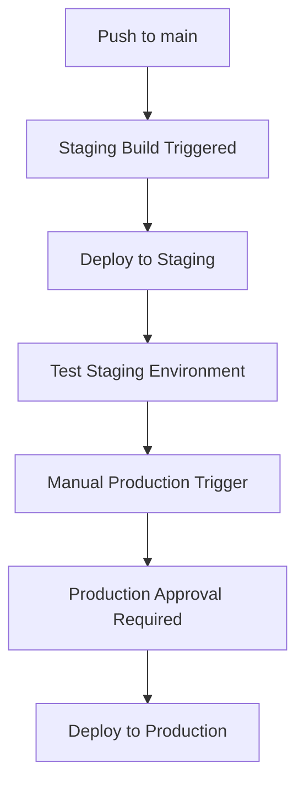

# Deployment Guide

This directory contains the complete infrastructure configuration and deployment setup for the Agentic RAG system. The infrastructure is managed using Terraform and deployed across multiple Google Cloud Platform projects.

## 🏗️ Infrastructure Overview

### Multi-Project Architecture

The system uses a multi-project setup for security and environment isolation:

- **`production-adk`**: Production environment and CI/CD runner
- **`staging-adk`**: Staging/development environment

### Key Components

- **Cloud Run**: Serverless container hosting for the ADK agent
- **Artifact Registry**: Docker image storage and management
- **Secret Manager**: Secure GitHub token storage
- **Vertex AI Search**: Document indexing and retrieval backend
- **Cloud Build**: CI/CD pipeline automation
- **IAM**: Service account and permission management

## 📁 Directory Structure

```
deployment/
├── terraform/              # Production infrastructure
│   ├── apis.tf            # Google Cloud APIs
│   ├── backend.tf         # Terraform state backend
│   ├── build_triggers.tf  # Cloud Build triggers
│   ├── github.tf          # GitHub integration
│   ├── iam.tf             # IAM roles and permissions
│   ├── service.tf         # Cloud Run service
│   ├── storage.tf         # Storage buckets and data stores
│   └── vars/
│       └── env.tfvars     # Production environment variables
└── terraform/dev/         # Staging infrastructure
    ├── apis.tf            # Development APIs
    ├── backend.tf         # Development state backend
    ├── iam.tf             # Development IAM
    ├── service.tf         # Development Cloud Run
    ├── storage.tf         # Development storage
    └── vars/
        └── env.tfvars     # Staging environment variables
```

## 🚀 Deployment Process

### Prerequisites

1. **Terraform**: Install [Terraform CLI](https://developer.hashicorp.com/terraform/downloads)
2. **Google Cloud CLI**: Install and authenticate with `gcloud auth login`
3. **Project Setup**: Ensure both projects exist and billing is enabled
4. **GitHub Token**: Create a Personal Access Token with required scopes

### Initial Infrastructure Setup

#### 1. Deploy Staging Environment

```bash
cd deployment/terraform/dev

# Initialize Terraform
terraform init

# Plan deployment
terraform plan -var-file=vars/env.tfvars

# Apply configuration
terraform apply -var-file=vars/env.tfvars
```

#### 2. Deploy Production Environment

```bash
cd deployment/terraform

# Initialize Terraform  
terraform init

# Plan deployment
terraform plan -var-file=vars/env.tfvars

# Apply configuration
terraform apply -var-file=vars/env.tfvars
```

### GitHub Token Setup

After infrastructure deployment, configure the GitHub token and FAL API key in Secret Manager:

```bash
# Create GitHub PAT secret in staging
gcloud secrets create github-pat-mcp \
  --project=staging-adk \
  --data-file=-  # Enter token when prompted

# Create GitHub PAT secret in production  
gcloud secrets create github-pat-mcp \
  --project=production-adk \
  --data-file=-  # Enter token when prompted

# Create FAL API key secret in staging
gcloud secrets create fal-api-key \
  --project=staging-adk \
  --data-file=-  # Enter FAL API key when prompted

# Create FAL API key secret in production
gcloud secrets create fal-api-key \
  --project=production-adk \
  --data-file=-  # Enter FAL API key when prompted
```

## 🔄 CI/CD Pipeline

### Build Triggers

The system includes two Cloud Build triggers:

1. **Staging Trigger** (`deploy-my-agentic-rag-staging`)
   - **Event**: Push to `main` branch
   - **Action**: Automatic deployment to staging
   - **Project**: `production-adk` (runner project)
   - **Target**: `staging-adk` environment

2. **Production Trigger** (`deploy-my-agentic-rag`)
   - **Event**: Manual trigger
   - **Action**: Deployment with manual approval
   - **Project**: `production-adk` 
   - **Target**: `production-adk` environment

### Deployment Workflow


```mermaid
graph TD
    A[Push to main] --> B[Staging Build Triggered]
    B --> C[Deploy to Staging]
    C --> D[Test Staging Environment]
    D --> E[Manual Production Trigger]
    E --> F[Production Approval Required]
    F --> G[Deploy to Production]
```

### Triggering Deployments

```bash
# Staging (automatic on push to main)
git push origin main

# Production (manual trigger)
gcloud builds triggers run deploy-my-agentic-rag \
  --project=production-adk \
  --branch=main
```

## 🔐 Security Configuration

### Service Accounts

- **Cloud Run Service Account**: `{project-id}-compute@developer.gserviceaccount.com`
- **Required Roles**:
  - `secretmanager.secretAccessor`: Access GitHub tokens and FAL API key
  - `aiplatform.user`: Vertex AI Search access
  - `logging.logWriter`: Application logging

### Secret Management

Secrets are stored securely in Google Secret Manager:

- **GitHub PAT**: `github-pat-mcp`
- **FAL API Key**: `fal-api-key`
- **Access**: Limited to Cloud Run service accounts
- **Rotation**: Manual process (update secret versions)

### Required GitHub Token Scopes

- `repo`: Full repository access
- `read:org`: Organization member access
- `read:user`: User profile access

### Required FAL API Key

- **Source**: Generate from [https://fal.ai/dashboard](https://fal.ai/dashboard)
- **Scope**: API access for image/video generation models
- **Format**: `{key_id}:{secret}` (e.g., `14fcfa4a-1f68-4e1f-ac71-75088668eeac:ab3d5f08a5f11e46b820aa729748027e`)

## 🌐 Service URLs

### Staging Environment
- **Service**: `https://my-agentic-rag-aktu2chyfa-uc.a.run.app`
- **Web UI**: `https://my-agentic-rag-aktu2chyfa-uc.a.run.app/dev-ui/`
- **Health**: `https://my-agentic-rag-aktu2chyfa-uc.a.run.app/health`

### Production Environment
- **Service**: `https://my-agentic-rag-dyrqvuqk4a-uc.a.run.app`
- **Web UI**: `https://my-agentic-rag-dyrqvuqk4a-uc.a.run.app/dev-ui/`
- **Health**: `https://my-agentic-rag-dyrqvuqk4a-uc.a.run.app/health`

## 🔧 Maintenance & Updates

### Infrastructure Updates

1. **Modify Terraform Configuration**: Update `.tf` files as needed
2. **Plan Changes**: Run `terraform plan` to review changes
3. **Apply Updates**: Run `terraform apply` to deploy changes
4. **Verify Deployment**: Check services and functionality

### Service Updates

Application updates are deployed automatically through the CI/CD pipeline:

1. **Code Changes**: Modify application code
2. **Commit & Push**: Push changes to `main` branch
3. **Staging Deploy**: Automatic deployment to staging
4. **Test & Validate**: Verify functionality in staging
5. **Production Deploy**: Manual trigger and approval

### Token Rotation

To rotate GitHub tokens:

```bash
# Update staging secret
echo "NEW_TOKEN" | gcloud secrets versions add github-personal-access-token \
  --project=staging-adk \
  --data-file=-

# Update production secret
echo "NEW_TOKEN" | gcloud secrets versions add github-personal-access-token \
  --project=production-adk \
  --data-file=-

# Restart services to pick up new token
gcloud run services update-traffic my-agentic-rag \
  --to-latest --region=us-central1
```

### CI/CD Service Account Permissions

**Important**: The CI/CD service accounts need access to the GitHub token secret for PR checks and integration tests to pass:

```bash
# Grant production CI service account access to GitHub token
gcloud secrets add-iam-policy-binding github-personal-access-token \
  --project=production-adk \
  --member="serviceAccount:my-agentic-rag-cb@production-adk.iam.gserviceaccount.com" \
  --role="roles/secretmanager.secretAccessor"

# Grant staging GitHub Actions service account access to GitHub token  
gcloud secrets add-iam-policy-binding github-personal-access-token \
  --project=staging-adk \
  --member="serviceAccount:github-actions@staging-adk.iam.gserviceaccount.com" \
  --role="roles/secretmanager.secretAccessor"
```

**Required Service Account Roles for CI/CD:**
- `secretmanager.secretAccessor`: Access to GitHub tokens
- `cloudbuild.builds.builder`: Execute build steps
- `aiplatform.user`: Access Vertex AI services for testing
- `logging.logWriter`: Write build logs

## 📊 Monitoring & Troubleshooting

### Health Monitoring

```bash
# Check service health
curl https://service-url/health

# View service logs
gcloud run services logs read my-agentic-rag \
  --region=us-central1 --project=PROJECT_ID

# Monitor build status
gcloud builds list --project=production-adk --limit=10
```

### Common Issues

#### Deployment Failures
- Check build logs: `gcloud builds log BUILD_ID`
- Verify IAM permissions
- Ensure secrets exist and are accessible

#### PR Check Failures
- **Common Issue**: CI service account lacks access to GitHub token secret
- **Solution**: Grant `secretmanager.secretAccessor` role to CI service accounts
- **Verification**: Check integration tests can access MCP GitHub tools

#### Service Errors
- Check Cloud Run logs for application errors
- Verify GitHub token validity and scopes
- Test Vertex AI Search connectivity

## 📚 Additional Resources

- [Google Cloud Run Documentation](https://cloud.google.com/run/docs)
- [Terraform Google Provider](https://registry.terraform.io/providers/hashicorp/google/latest/docs)
- [Cloud Build Configuration](https://cloud.google.com/build/docs/configuring-builds/create-basic-configuration)
- [Secret Manager Best Practices](https://cloud.google.com/secret-manager/docs/best-practices)

---

## 🗂️ Data Ingestion Pipeline

### Overview
Automated data ingestion into Vertex AI Search for building Retrieval Augmented Generation (RAG) applications. The pipeline orchestrates the complete workflow: loading data, chunking, generating embeddings, and importing into Vertex AI Search datastore.

### Setup and Execution

#### Prerequisites
```bash
# Set project ID environment variable
export PROJECT_ID="YOUR_PROJECT_ID"
```

#### Infrastructure Setup
```bash
# Deploy development environment with Terraform
make setup-dev-env
```

#### Pipeline Execution
```bash
# Run data ingestion pipeline
make data-ingestion
```

### Pipeline Configuration
- **Parameters**: Automatically configured based on datastore type
- **Scheduling**: Supports cron-based periodic execution via `--schedule-only` and `--cron-schedule` flags
- **Monitoring**: Vertex AI Pipelines dashboard for progress tracking
- **Dependencies**: Automatic installation via `make install`

### Troubleshooting
If you encounter `"embedding field path: embedding not found in schema"` error after initial ingestion, wait a few minutes for Vertex AI Search to complete indexing.

## 🧪 Load Testing Framework

### Overview
Comprehensive load testing using [Locust](https://locust.io/) to measure performance under various load conditions.

### Test Configuration
- **Framework**: Locust v2.31.1
- **Duration**: 30-second test runs
- **Concurrency**: 10 users with 0.5/second ramp-up rate
- **Scenarios**: Health checks, chat requests, authentication, response time measurements

### Local Testing
```bash
# Install Locust
pip install locust==2.31.1

# Run against staging with web UI
locust -f tests/load_test/load_test.py -H https://your-staging-url

# Headless execution
locust -f tests/load_test/load_test.py --headless \
  -H https://your-staging-url -t 30s -u 10 -r 0.5
```

### CI/CD Integration
Load tests execute automatically after successful staging deployment:
1. **Trigger**: Post-deployment validation
2. **Results**: CSV/HTML reports stored in GCS
3. **Metrics**: Request/response times, success rates, throughput analysis
4. **Validation**: Performance regression detection

### Results Analysis
Test outputs include:
- **Performance Metrics**: Latency percentiles and throughput measurements
- **Success Rates**: Request success/failure ratios  
- **Error Analysis**: Detailed failure categorization
- **Trend Analysis**: Performance comparison across deployments

## 📋 Infrastructure Components

### Terraform Configuration Summary
```
deployment/terraform/          # Production infrastructure
├── apis.tf                   # Google Cloud API enablement
├── backend.tf                # Terraform state management
├── build_triggers.tf         # CI/CD pipeline configuration  
├── github.tf                 # GitHub integration setup
├── iam.tf                    # Service accounts and permissions
├── service.tf                # Cloud Run service configuration
├── storage.tf                # GCS buckets and data stores
└── vars/env.tfvars          # Production environment variables

deployment/terraform/dev/      # Staging infrastructure  
├── apis.tf                   # Development API configuration
├── backend.tf                # Dev state management
├── iam.tf                    # Dev IAM configuration
├── service.tf                # Dev Cloud Run setup
├── storage.tf                # Dev storage configuration
└── vars/env.tfvars          # Staging environment variables
```

### Service Dependencies
- **Cloud Run**: Serverless ADK agent hosting with automatic scaling
- **Artifact Registry**: Multi-region Docker image storage and management
- **Secret Manager**: Encrypted storage for GitHub PAT and FAL API keys
- **Cloud Build**: GitOps-based CI/CD with manual production approval
- **Vertex AI Search**: RAG backend with embedding generation and search
- **Cloud Storage**: Session state, artifacts, and test results persistence
- **Cloud Logging**: Centralized logging with structured log analysis
- **IAM**: Principle of least privilege with service account isolation

---

*This deployment guide provides comprehensive infrastructure management for production-ready WhatsApp ADK bot deployment with automated testing, monitoring, and data pipeline integration.*